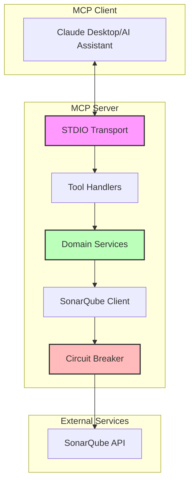

# Architecture Documentation

## Overview

The SonarQube MCP Server is designed as a Model Context Protocol (MCP) server that bridges SonarQube's powerful code quality analysis capabilities with AI assistants. This document provides a comprehensive overview of the system architecture, design decisions, and implementation details.

## Architecture Diagram



## Core Components

### 1. Transport Layer

The server uses **STDIO Transport** exclusively, providing:

- Simple, reliable communication via standard input/output
- No network configuration required
- Perfect for local usage and MCP gateway deployments
- Minimal resource overhead

### 2. Tool Handlers

MCP tools are the primary interface for AI assistants to interact with SonarQube:

- Each tool maps to specific SonarQube API endpoints
- Input validation and parameter transformation
- Error handling with user-friendly messages
- Response formatting for AI consumption

### 3. Domain Services

Following Domain-Driven Design (DDD), functionality is organized into cohesive domains:

- **Projects Domain**: Project management and navigation
- **Issues Domain**: Code issues, bugs, and vulnerabilities
- **Metrics Domain**: Available metrics and their definitions
- **Measures Domain**: Metric values and history
- **Quality Gates Domain**: Quality gate definitions and status
- **Hotspots Domain**: Security hotspots management
- **Source Code Domain**: Source viewing with SCM blame info
- **System Domain**: Health and status monitoring
- **Components Domain**: File and directory navigation

### 4. SonarQube Client

The client layer handles all communication with SonarQube:

- **Authentication**: Supports token, basic auth, and system passcode
- **Error Handling**: Comprehensive error messages with solutions
- **Circuit Breaker**: Prevents cascading failures
- **Response Caching**: Reduces API calls for repeated requests

### 5. Circuit Breaker Pattern

Protects against SonarQube API failures:

```typescript
interface CircuitBreakerConfig {
  timeout: 30000; // 30 second timeout
  errorThreshold: 0.5; // 50% error rate triggers open
  volumeThreshold: 5; // Minimum 5 requests
  resetTimeout: 60000; // 60 seconds before retry
}
```

## Data Flow

1. **Request Flow**:

   ```
   AI Assistant → STDIO → Tool Handler → Domain Service → SonarQube Client → Circuit Breaker → SonarQube API
   ```

2. **Response Flow**:
   ```
   SonarQube API → Circuit Breaker → SonarQube Client → Domain Service → Tool Handler → STDIO → AI Assistant
   ```

## Authentication

The server supports multiple authentication methods for SonarQube:

1. **Token Authentication** (Recommended)
   - Bearer tokens for SonarQube 10.0+
   - Token as username for older versions
2. **Basic Authentication**
   - Username/password combination
   - Suitable for self-hosted instances
3. **System Passcode**
   - For automated deployment scenarios

## Error Handling

Multi-level error handling ensures reliability:

1. **Transport Level**: Connection and protocol errors
2. **Tool Level**: Parameter validation and tool-specific errors
3. **Domain Level**: Business logic validation
4. **Client Level**: API communication errors
5. **Circuit Breaker**: Failure prevention and recovery

## Logging

File-based logging to avoid stdio conflicts:

```typescript
interface LogConfig {
  file?: string; // Log file path
  level: 'DEBUG' | 'INFO' | 'WARN' | 'ERROR';
  format: 'json' | 'text';
}
```

## Performance Optimizations

1. **Minimal Dependencies**: Reduced package size
2. **Lazy Loading**: Components loaded on demand
3. **Response Caching**: Reduces API calls
4. **Circuit Breaker**: Prevents unnecessary failed requests
5. **Efficient Data Structures**: Optimized for common operations

## Deployment Architecture

### Local Deployment

```
┌─────────────────┐     ┌──────────────┐     ┌─────────────┐
│ Claude Desktop  │────▶│  MCP Server  │────▶│ SonarQube   │
│  (MCP Client)   │◀────│   (stdio)    │◀────│    API      │
└─────────────────┘     └──────────────┘     └─────────────┘
```

### Gateway Deployment

```
┌─────────────────┐     ┌──────────────┐     ┌──────────────┐     ┌─────────────┐
│   AI Client     │────▶│ MCP Gateway  │────▶│  MCP Server  │────▶│ SonarQube   │
│                 │◀────│              │◀────│   (stdio)    │◀────│    API      │
└─────────────────┘     └──────────────┘     └──────────────┘     └─────────────┘
                              │
                              ├── Authentication
                              ├── Multi-tenancy
                              ├── Load Balancing
                              └── Monitoring
```

## Design Principles

1. **Simplicity**: stdio-only transport reduces complexity
2. **Reliability**: Circuit breakers and comprehensive error handling
3. **Performance**: Minimal resource usage and efficient operations
4. **Flexibility**: Works with various MCP gateways
5. **Maintainability**: Clean domain separation and clear interfaces

## Future Considerations

While the current stdio-only design is optimal for most use cases, the architecture allows for:

1. **Gateway Extensions**: Enhanced features via MCP gateways
2. **Performance Improvements**: Further optimizations as needed
3. **Additional Tools**: New SonarQube features as they become available
4. **Enhanced Caching**: Smarter caching strategies

## Architecture Decision Records

All significant architectural decisions are documented in ADRs located in `/docs/architecture/decisions/`. Key decisions include:

- ADR-0003: Adopt Model Context Protocol
- ADR-0004: Use SonarQube Web API Client
- ADR-0005: Domain-Driven Design approach
- ADR-0010: Use stdio transport for MCP communication
- ADR-0011: Docker containerization for deployment
