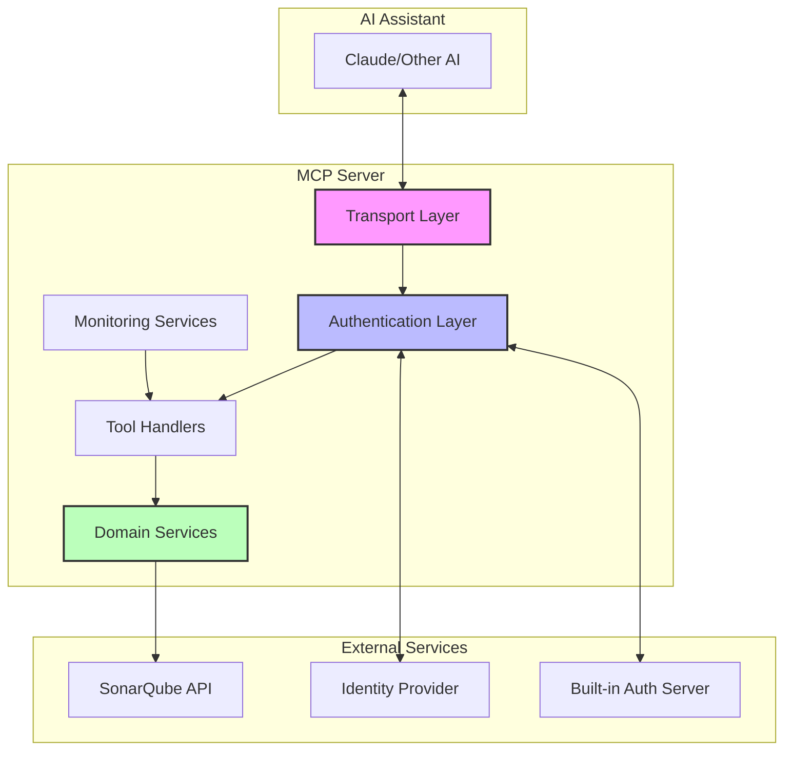
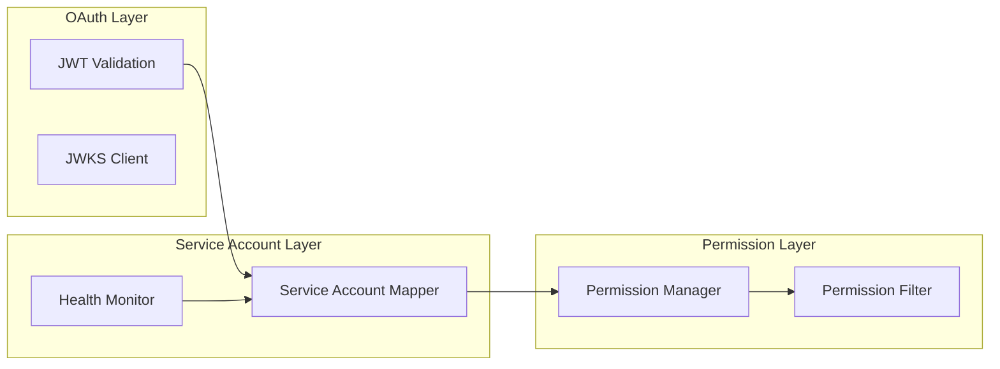
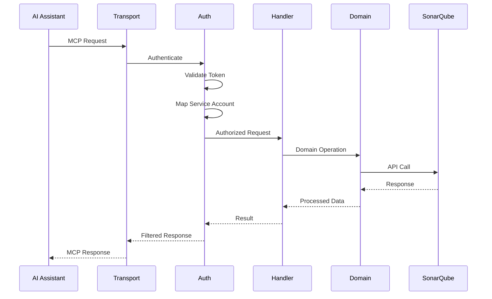

# Architecture Documentation

## Overview

The SonarQube MCP Server is designed as a Model Context Protocol (MCP) server that bridges SonarQube's powerful code quality analysis capabilities with AI assistants. This document provides a comprehensive overview of the system architecture, design decisions, and implementation details.

## Architecture Diagram



## Core Components

### 1. Transport Layer

The transport layer provides flexible communication mechanisms between AI assistants and the MCP server:

- **STDIO Transport**: Default for local, single-user scenarios
- **HTTP Transport**: Enterprise-grade transport with OAuth 2.0 support
  - Streamable HTTP endpoints for MCP protocol
  - Health check endpoints (`/health`, `/ready`)
  - OAuth 2.0 metadata discovery endpoints
  - Session management for concurrent users

### 2. Authentication & Authorization

#### Multi-layered Security Architecture



#### Components:

1. **Token Validator**: Validates JWT tokens with signature verification
2. **Service Account Mapper**: Maps OAuth identities to SonarQube service accounts
3. **Permission Manager**: Group-based access control with regex project filtering
4. **Built-in Authorization Server**: OAuth 2.0 server for local development/testing

### 3. Domain Services

Following Domain-Driven Design (DDD), functionality is organized into cohesive domains:

- **Projects Domain**: Project management and navigation
- **Issues Domain**: Code issues, bugs, and vulnerabilities
- **Metrics Domain**: Available metrics and their definitions
- **Measures Domain**: Metric values and history
- **Quality Gates Domain**: Quality gate definitions and status
- **Hotspots Domain**: Security hotspots management
- **Source Code Domain**: Source viewing with SCM blame info
- **Components Domain**: File and directory navigation
- **System Domain**: System health and status

### 4. Tool Handlers

Each SonarQube operation is exposed as a discrete MCP tool:

```typescript
interface MCPTool {
  name: string;
  description: string;
  inputSchema: z.ZodSchema;
  handler: (params: any) => Promise<any>;
}
```

Tools are automatically discovered and registered by the MCP SDK.

### 5. Monitoring & Observability

Comprehensive monitoring stack for production deployments:

- **Metrics Service**: Prometheus-compatible metrics
- **Tracing Service**: OpenTelemetry distributed tracing
- **Health Service**: Liveness and readiness probes
- **Circuit Breaker**: Fault tolerance for external services
- **Audit Logger**: Compliance-ready audit trail

## Data Flow

### Request Processing Pipeline



## Security Architecture

### Defense in Depth

1. **Transport Security**: TLS/HTTPS for all external communications
2. **Authentication**: JWT validation with signature verification
3. **Authorization**: Fine-grained permissions based on groups/roles
4. **Service Accounts**: Isolated credentials per team/environment
5. **Audit Trail**: Comprehensive logging of all operations
6. **Data Filtering**: Redaction of sensitive information

### Permission Model

```yaml
permissions:
  - group: "developers"
    projects: ["^project-.*"]
    tools:
      allow: ["*"]
      deny: ["system_*"]
    issues:
      severities: ["MAJOR", "CRITICAL", "BLOCKER"]
      redactPersonalData: false
    
  - group: "external-contractors"  
    projects: ["^public-.*"]
    tools:
      allow: ["issues", "metrics"]
    issues:
      redactPersonalData: true
```

## Scalability & Performance

### Caching Strategy

- **Token Cache**: Validated tokens cached for performance
- **Permission Cache**: Computed permissions cached per session
- **JWKS Cache**: Public keys cached with TTL
- **Service Account Health**: Periodic health checks with caching

### Connection Pooling

- HTTP keep-alive for SonarQube API connections
- Connection pool per service account
- Automatic failover for failed accounts

## Deployment Architecture

### Kubernetes Deployment

```yaml
apiVersion: apps/v1
kind: Deployment
spec:
  replicas: 3
  template:
    spec:
      containers:
      - name: sonarqube-mcp
        resources:
          requests:
            memory: "256Mi"
            cpu: "100m"
          limits:
            memory: "512Mi"
            cpu: "500m"
```

### High Availability

- Stateless design enables horizontal scaling
- Health checks for automatic restarts
- Circuit breakers prevent cascade failures
- Service account failover for resilience

## Technology Stack

- **Runtime**: Node.js 20+ with TypeScript
- **MCP SDK**: @modelcontextprotocol/sdk
- **HTTP Server**: Express.js
- **Authentication**: jsonwebtoken, jose
- **Monitoring**: Prometheus, OpenTelemetry
- **Testing**: Jest with 80%+ coverage
- **Container**: Docker with multi-stage builds

## Architecture Decision Records

Key architectural decisions are documented in ADRs:

- [ADR-003](architecture/decisions/0003-adopt-model-context-protocol-for-sonarqube-integration.md): Adopt MCP
- [ADR-005](architecture/decisions/0005-domain-driven-design-of-sonarqube-modules.md): Domain-Driven Design
- [ADR-015](architecture/decisions/0015-transport-architecture-refactoring.md): Transport Architecture
- [ADR-016](architecture/decisions/0016-http-transport-with-oauth-2-0-metadata-endpoints.md): HTTP Transport
- [ADR-017](architecture/decisions/0017-comprehensive-audit-logging-system.md): Audit Logging

## Future Considerations

1. **WebSocket Transport**: Real-time bidirectional communication
2. **Distributed Caching**: Redis for shared cache across instances
3. **Message Queue Integration**: Async processing for long operations
4. **Multi-Region Deployment**: Geographic distribution for latency
5. **Advanced Analytics**: Usage patterns and optimization insights