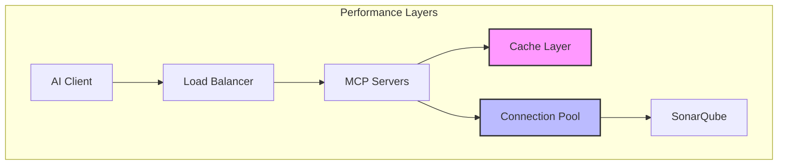

# Performance Tuning Guide

## Overview

This guide provides comprehensive performance tuning recommendations for the SonarQube MCP Server in production environments. It covers Node.js optimization, connection pooling, caching strategies, and monitoring.

## Performance Architecture



## Node.js Optimization

### 1. Memory Configuration

```bash
# Increase heap size for large workloads
NODE_OPTIONS="--max-old-space-size=2048"

# Enable heap profiling
NODE_OPTIONS="--max-old-space-size=2048 --heap-prof"

# Optimize garbage collection
NODE_OPTIONS="--max-old-space-size=2048 --max-semi-space-size=128"
```

### 2. V8 Flags

```bash
# Production optimizations
NODE_OPTIONS="--max-old-space-size=2048 \
  --optimize-for-size \
  --max-semi-space-size=128 \
  --max-old-space-size=2048 \
  --gc-interval=100"

# CPU profiling
NODE_OPTIONS="--prof --log-source-code"
```

### 3. Cluster Mode

For multi-core systems:

```javascript
// cluster.js
const cluster = require('cluster');
const numCPUs = require('os').cpus().length;

if (cluster.isMaster) {
  console.log(`Master ${process.pid} is running`);
  
  // Fork workers
  for (let i = 0; i < numCPUs; i++) {
    cluster.fork();
  }
  
  cluster.on('exit', (worker, code, signal) => {
    console.log(`Worker ${worker.process.pid} died`);
    cluster.fork(); // Restart worker
  });
} else {
  require('./dist/index.js');
}
```

## Connection Pool Tuning

### 1. HTTP Agent Configuration

```bash
# Connection pool settings
HTTP_AGENT_MAX_SOCKETS=100          # Max concurrent connections
HTTP_AGENT_MAX_FREE_SOCKETS=10     # Max idle connections
HTTP_AGENT_TIMEOUT=60000            # Socket timeout (ms)
HTTP_AGENT_KEEP_ALIVE_MSECS=30000  # Keep-alive interval

# For high-throughput environments
HTTP_AGENT_MAX_SOCKETS=500
HTTP_AGENT_MAX_FREE_SOCKETS=50
```

### 2. Service Account Pool

```bash
# Optimize service account usage
SERVICE_ACCOUNT_POOL_SIZE=10        # Number of accounts
SERVICE_ACCOUNT_POOL_STRATEGY=round-robin
SERVICE_ACCOUNT_HEALTH_CHECK_PARALLEL=true
SERVICE_ACCOUNT_HEALTH_CHECK_BATCH_SIZE=5
```

### 3. Database Connection Pooling

For audit log database (if using):

```bash
# PostgreSQL connection pool
DB_POOL_MIN=5
DB_POOL_MAX=20
DB_POOL_IDLE_TIMEOUT=30000
DB_POOL_CONNECTION_TIMEOUT=5000
```

## Caching Strategies

### 1. In-Memory Caching

```bash
# Token validation cache
TOKEN_CACHE_TTL=3600000       # 1 hour
TOKEN_CACHE_MAX_SIZE=10000    # Max entries
TOKEN_CACHE_UPDATE_AGE=300000 # Refresh after 5 min

# Permission cache
PERMISSION_CACHE_TTL=600000   # 10 minutes
PERMISSION_CACHE_MAX_SIZE=5000

# JWKS cache
JWKS_CACHE_TTL=86400000      # 24 hours
JWKS_CACHE_MAX_ENTRIES=10
```

### 2. Cache Implementation

```typescript
// Example cache configuration
const cacheConfig = {
  token: {
    max: 10000,
    ttl: 1000 * 60 * 60,        // 1 hour
    updateAgeOnGet: true,
    stale: true,                 // Return stale while revalidating
  },
  permission: {
    max: 5000,
    ttl: 1000 * 60 * 10,        // 10 minutes
    updateAgeOnGet: false,
  },
  sonarqubeApi: {
    max: 1000,
    ttl: 1000 * 60 * 5,         // 5 minutes
    stale: true,
  }
};
```

### 3. Redis Caching (Advanced)

For distributed deployments:

```bash
# Redis configuration
REDIS_URL=redis://redis.company.com:6379
REDIS_KEY_PREFIX=mcp:
REDIS_TTL_DEFAULT=300
REDIS_ENABLE_OFFLINE_QUEUE=true
REDIS_CONNECT_TIMEOUT=5000
REDIS_COMMAND_TIMEOUT=5000
```

## Request Optimization

### 1. Batch Processing

```bash
# Enable request batching
REQUEST_BATCH_ENABLED=true
REQUEST_BATCH_SIZE=50
REQUEST_BATCH_TIMEOUT=100  # ms
```

### 2. Compression

```bash
# Enable compression
COMPRESSION_ENABLED=true
COMPRESSION_LEVEL=6        # 1-9 (speed vs ratio)
COMPRESSION_THRESHOLD=1024 # Minimum size in bytes
```

### 3. Rate Limiting

```bash
# Configure rate limits
RATE_LIMIT_WINDOW=60000         # 1 minute
RATE_LIMIT_MAX_REQUESTS=1000    # Per window
RATE_LIMIT_BURST=50             # Burst allowance
RATE_LIMIT_STRATEGY=sliding-window
```

## Monitoring & Metrics

### 1. Performance Metrics

Key metrics to monitor:

```yaml
# Prometheus queries
- name: Response Time
  query: histogram_quantile(0.95, http_request_duration_seconds_bucket)
  
- name: Throughput
  query: rate(http_requests_total[5m])
  
- name: Error Rate
  query: rate(http_requests_total{status=~"5.."}[5m])
  
- name: Cache Hit Ratio
  query: rate(cache_hits_total[5m]) / rate(cache_requests_total[5m])
  
- name: Connection Pool Usage
  query: connection_pool_active / connection_pool_size
  
- name: Memory Usage
  query: nodejs_heap_size_used_bytes / nodejs_heap_size_total_bytes
```

### 2. Custom Metrics

```typescript
// Performance tracking
const metrics = {
  // Histogram for API call duration
  apiCallDuration: new Histogram({
    name: 'sonarqube_api_call_duration_seconds',
    help: 'SonarQube API call duration',
    labelNames: ['method', 'endpoint'],
    buckets: [0.1, 0.5, 1, 2, 5, 10]
  }),
  
  // Gauge for connection pool
  connectionPoolSize: new Gauge({
    name: 'connection_pool_size',
    help: 'Current connection pool size',
    labelNames: ['pool']
  }),
  
  // Counter for cache operations
  cacheOperations: new Counter({
    name: 'cache_operations_total',
    help: 'Cache operations',
    labelNames: ['operation', 'cache', 'result']
  })
};
```

### 3. APM Integration

```bash
# New Relic
NEW_RELIC_APP_NAME=sonarqube-mcp
NEW_RELIC_LICENSE_KEY=your-key

# DataDog
DD_AGENT_HOST=localhost
DD_TRACE_AGENT_PORT=8126
DD_SERVICE=sonarqube-mcp

# AppDynamics
APPDYNAMICS_CONTROLLER_HOST=controller.company.com
APPDYNAMICS_AGENT_ACCOUNT_NAME=company
APPDYNAMICS_AGENT_APPLICATION_NAME=sonarqube-mcp
```

## Load Testing

### 1. Artillery Configuration

```yaml
# load-test.yml
config:
  target: "https://mcp.company.com"
  phases:
    - duration: 60
      arrivalRate: 10
      name: "Warm up"
    - duration: 300
      arrivalRate: 100
      name: "Sustained load"
    - duration: 60
      arrivalRate: 200
      name: "Peak load"
  processor: "./load-test-processor.js"

scenarios:
  - name: "Issue Search"
    flow:
      - post:
          url: "/"
          headers:
            Authorization: "Bearer {{ token }}"
          json:
            jsonrpc: "2.0"
            method: "tools/call"
            params:
              name: "issues"
              arguments:
                project_key: "{{ project }}"
                severities: ["CRITICAL", "BLOCKER"]
```

### 2. K6 Performance Test

```javascript
// k6-test.js
import http from 'k6/http';
import { check } from 'k6';

export let options = {
  stages: [
    { duration: '2m', target: 100 },
    { duration: '5m', target: 100 },
    { duration: '2m', target: 200 },
    { duration: '5m', target: 200 },
    { duration: '2m', target: 0 },
  ],
  thresholds: {
    http_req_duration: ['p(95)<500'],
    http_req_failed: ['rate<0.01'],
  },
};

export default function() {
  let response = http.post(
    'https://mcp.company.com/',
    JSON.stringify({
      jsonrpc: '2.0',
      method: 'tools/call',
      params: {
        name: 'issues',
        arguments: { project_key: 'test-project' }
      }
    }),
    {
      headers: {
        'Content-Type': 'application/json',
        'Authorization': `Bearer ${__ENV.TOKEN}`
      }
    }
  );
  
  check(response, {
    'status is 200': (r) => r.status === 200,
    'response time < 500ms': (r) => r.timings.duration < 500,
  });
}
```

## Optimization Techniques

### 1. Query Optimization

```typescript
// Inefficient: Multiple sequential calls
const issues = await getIssues(projectKey);
const metrics = await getMetrics(projectKey);
const measures = await getMeasures(projectKey);

// Optimized: Parallel execution
const [issues, metrics, measures] = await Promise.all([
  getIssues(projectKey),
  getMetrics(projectKey),
  getMeasures(projectKey)
]);
```

### 2. Pagination Strategy

```bash
# Optimize page sizes
DEFAULT_PAGE_SIZE=100
MAX_PAGE_SIZE=500

# Pre-fetch next page
PREFETCH_ENABLED=true
PREFETCH_THRESHOLD=0.8  # Start prefetch at 80% of current page
```

### 3. Circuit Breaker

```bash
# Circuit breaker configuration
CIRCUIT_BREAKER_ENABLED=true
CIRCUIT_BREAKER_TIMEOUT=5000      # 5 seconds
CIRCUIT_BREAKER_THRESHOLD=50      # 50% failure rate
CIRCUIT_BREAKER_DURATION=30000    # Open for 30 seconds
CIRCUIT_BREAKER_BUCKETS=10        # Rolling window buckets
```

## Infrastructure Optimization

### 1. Container Resources

```yaml
# Kubernetes resources
resources:
  requests:
    memory: "512Mi"
    cpu: "250m"
  limits:
    memory: "2Gi"
    cpu: "2"
```

### 2. JVM Tuning (for SonarQube)

```bash
# SonarQube performance
SONAR_WEB_JAVAOPTS="-Xmx2g -Xms2g -XX:+UseG1GC"
SONAR_CE_JAVAOPTS="-Xmx4g -Xms2g -XX:+UseG1GC"
SONAR_SEARCH_JAVAOPTS="-Xmx1g -Xms1g"
```

### 3. Network Optimization

```bash
# TCP tuning
sysctl -w net.core.somaxconn=65535
sysctl -w net.ipv4.tcp_max_syn_backlog=65535
sysctl -w net.ipv4.ip_local_port_range="1024 65535"
sysctl -w net.ipv4.tcp_tw_reuse=1
```

## Troubleshooting Performance

### 1. Slow Startup

```bash
# Profile startup
NODE_OPTIONS="--trace-exit --trace-warnings" node dist/index.js

# Lazy loading
LAZY_LOAD_MODULES=true
STARTUP_TIMEOUT=60000
```

### 2. Memory Leaks

```bash
# Heap snapshot on signal
kill -USR2 <pid>

# Automatic heap dumps
HEAP_SNAPSHOT_ON_OOM=true
HEAP_SNAPSHOT_DIR=/tmp/heapdumps
```

### 3. CPU Profiling

```bash
# Generate CPU profile
node --prof dist/index.js

# Process profile
node --prof-process isolate-*.log > profile.txt
```

## Best Practices

### 1. Resource Planning

| Concurrent Users | CPU | Memory | Connections |
|-----------------|-----|---------|-------------|
| < 50 | 1 core | 512 MB | 20 |
| 50-200 | 2 cores | 1 GB | 50 |
| 200-500 | 4 cores | 2 GB | 100 |
| 500-1000 | 8 cores | 4 GB | 200 |
| > 1000 | 16 cores | 8 GB | 500 |

### 2. Scaling Strategy

```yaml
# Horizontal scaling
replicas: 3
strategy:
  type: RollingUpdate
  rollingUpdate:
    maxSurge: 1
    maxUnavailable: 0

# Vertical scaling
resources:
  requests:
    memory: "1Gi"
    cpu: "500m"
  limits:
    memory: "4Gi"
    cpu: "4"
```

### 3. Monitoring Checklist

- [ ] Response time P50, P95, P99
- [ ] Request rate and error rate
- [ ] CPU and memory utilization
- [ ] Connection pool usage
- [ ] Cache hit ratios
- [ ] Circuit breaker state
- [ ] Garbage collection metrics
- [ ] Event loop lag
- [ ] Active handles and requests

## Performance SLOs

Define Service Level Objectives:

```yaml
slos:
  - name: API Response Time
    target: 95% of requests < 500ms
    window: 5 minutes
    
  - name: Availability
    target: 99.9% uptime
    window: 30 days
    
  - name: Error Rate
    target: < 0.1% errors
    window: 1 hour
    
  - name: Cache Hit Ratio
    target: > 80% hits
    window: 15 minutes
```

## Continuous Optimization

### 1. Performance Testing Pipeline

```yaml
# CI/CD performance gates
performance-test:
  stage: test
  script:
    - k6 run k6-test.js
    - artillery run load-test.yml
  artifacts:
    reports:
      performance: performance-report.html
```

### 2. Automated Tuning

```bash
# Auto-scaling based on metrics
AUTOSCALE_ENABLED=true
AUTOSCALE_MIN_REPLICAS=3
AUTOSCALE_MAX_REPLICAS=10
AUTOSCALE_CPU_THRESHOLD=70
AUTOSCALE_MEMORY_THRESHOLD=80
```

For performance support: performance@sonarqube-mcp.io