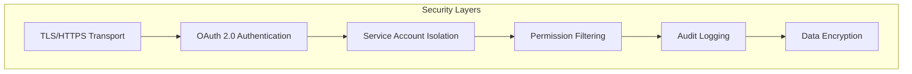

# Security Configuration Guide

## Overview

This guide provides comprehensive security configuration instructions for the SonarQube MCP Server. It covers authentication, authorization, encryption, and security best practices for enterprise deployments.

## Security Architecture

The SonarQube MCP Server implements defense-in-depth with multiple security layers:



## Authentication

### OAuth 2.0 Configuration

#### 1. JWT Token Validation

Configure JWT validation with your identity provider:

```bash
# Required: OAuth issuer
MCP_HTTP_OAUTH_ISSUER=https://auth.company.com

# Required: Expected audience
MCP_HTTP_OAUTH_AUDIENCE=sonarqube-mcp

# Option 1: Public key file
MCP_HTTP_OAUTH_PUBLIC_KEY_PATH=/config/oauth-public.pem

# Option 2: JWKS endpoint (coming soon)
# MCP_HTTP_OAUTH_JWKS_URI=https://auth.company.com/.well-known/jwks.json

# Option 3: Environment variable (for testing)
MCP_HTTP_OAUTH_PUBLIC_KEY="-----BEGIN PUBLIC KEY-----
MIIBIjANBgkqhkiG9w0BAQEFAAOCAQ8AMIIBCgKCAQEA...
-----END PUBLIC KEY-----"
```

#### 2. Token Requirements

Valid tokens must include:

- **iss** (issuer): Must match `MCP_HTTP_OAUTH_ISSUER`
- **aud** (audience): Must include `MCP_HTTP_OAUTH_AUDIENCE`
- **exp** (expiration): Must be in the future
- **nbf** (not before): Must be in the past (if present)
- **sub** (subject): User identifier
- **groups** or **roles**: For permission mapping

Example JWT payload:
```json
{
  "iss": "https://auth.company.com",
  "aud": ["sonarqube-mcp"],
  "sub": "user123",
  "exp": 1234567890,
  "groups": ["developers", "team-alpha"],
  "email": "user@company.com"
}
```

### Service Account Management

#### 1. Basic Configuration

```bash
# Enable service account management
SERVICE_ACCOUNT_ENABLE=true

# Default service account (fallback)
SONARQUBE_TOKEN=squ_default_token

# Team-specific service accounts
SERVICE_ACCOUNT_SA1_USERNAME=team-alpha
SERVICE_ACCOUNT_SA1_TOKEN=squ_team_alpha_token

SERVICE_ACCOUNT_SA2_USERNAME=team-beta
SERVICE_ACCOUNT_SA2_TOKEN=squ_team_beta_token
```

#### 2. Advanced Mapping Rules

```bash
# Map users to service accounts based on claims
SERVICE_ACCOUNT_SA1_USER_PATTERN="^alpha-.*"
SERVICE_ACCOUNT_SA1_ISSUER_PATTERN="https://auth.alpha.company.com"
SERVICE_ACCOUNT_SA1_GROUP_PATTERN="team-alpha|alpha-developers"
SERVICE_ACCOUNT_SA1_SCOPE_PATTERN="sonarqube:alpha:.*"

# Priority-based mapping (higher number = higher priority)
SERVICE_ACCOUNT_SA1_PRIORITY=100
SERVICE_ACCOUNT_SA2_PRIORITY=50
```

#### 3. Health Monitoring

```bash
# Enable health checks
SERVICE_ACCOUNT_HEALTH_CHECK_ENABLED=true
SERVICE_ACCOUNT_HEALTH_CHECK_INTERVAL=300000  # 5 minutes
SERVICE_ACCOUNT_HEALTH_CHECK_TIMEOUT=30000    # 30 seconds

# Failover configuration
SERVICE_ACCOUNT_FAILOVER_ENABLED=true
SERVICE_ACCOUNT_FAILOVER_RETRY_DELAY=60000    # 1 minute
```

## Authorization

### Permission System Configuration

#### 1. Basic Permissions

Create a permissions configuration file:

```json
{
  "rules": [
    {
      "name": "Developers Full Access",
      "priority": 100,
      "groups": ["developers"],
      "permissions": {
        "projects": [".*"],
        "tools": {
          "allow": ["*"]
        },
        "issues": {
          "severities": ["*"],
          "statuses": ["*"],
          "redactPersonalData": false
        },
        "read": true,
        "write": true
      }
    },
    {
      "name": "External Contractors Limited",
      "priority": 50,
      "groups": ["contractors"],
      "permissions": {
        "projects": ["^public-.*", "^opensource-.*"],
        "tools": {
          "allow": ["issues", "metrics", "measures"],
          "deny": ["system_*", "*_update", "*_create", "*_delete"]
        },
        "issues": {
          "severities": ["CRITICAL", "BLOCKER"],
          "statuses": ["OPEN", "CONFIRMED"],
          "redactPersonalData": true
        },
        "read": true,
        "write": false
      }
    },
    {
      "name": "Security Team",
      "priority": 200,
      "groups": ["security"],
      "permissions": {
        "projects": [".*"],
        "tools": {
          "allow": ["*"]
        },
        "issues": {
          "types": ["VULNERABILITY", "SECURITY_HOTSPOT"],
          "redactPersonalData": false
        },
        "read": true,
        "write": true,
        "bypassFilters": true
      }
    }
  ]
}
```

#### 2. Environment Variable Configuration

```bash
# Load permissions from file
PERMISSION_CONFIG_PATH=/config/permissions.json

# Or configure inline (JSON string)
PERMISSION_CONFIG='{
  "rules": [
    {
      "groups": ["developers"],
      "permissions": {
        "projects": [".*"],
        "read": true,
        "write": true
      }
    }
  ]
}'

# Cache settings
PERMISSION_CACHE_TTL=300000  # 5 minutes
PERMISSION_CACHE_MAX_SIZE=1000
```

### Tool-Level Authorization

Control access to specific MCP tools:

```json
{
  "tools": {
    "allow": [
      "projects",
      "issues",
      "metrics",
      "measures",
      "quality_gates",
      "quality_gate_status"
    ],
    "deny": [
      "system_health",
      "system_status",
      "markIssueWontFix",
      "assignIssue"
    ]
  }
}
```

### Project Filtering

Use regex patterns for fine-grained project access:

```json
{
  "projects": [
    "^team-alpha-.*",           // All team-alpha projects
    "^(dev|staging)-.*",        // Dev and staging projects
    "(?!.*-prod$).*",           // Exclude production projects
    "specific-project-name"     // Exact match
  ]
}
```

## Data Protection

### 1. PII Redaction

Configure automatic PII redaction:

```bash
# Enable PII redaction in audit logs
AUDIT_LOG_PII_REDACTION=true

# Custom redaction patterns
AUDIT_LOG_PII_PATTERNS='[
  {"pattern": "\\b[A-Za-z0-9._%+-]+@[A-Za-z0-9.-]+\\.[A-Z|a-z]{2,}\\b", "replacement": "[EMAIL]"},
  {"pattern": "\\b(?:\\d{3}-?){2}\\d{4}\\b", "replacement": "[PHONE]"},
  {"pattern": "\\b\\d{3}-\\d{2}-\\d{4}\\b", "replacement": "[SSN]"}
]'
```

### 2. Response Filtering

Enable personal data redaction in API responses:

```json
{
  "permissions": {
    "issues": {
      "redactPersonalData": true,
      "redactFields": ["author", "assignee", "email", "updatedBy"]
    }
  }
}
```

### 3. Encryption at Rest

For sensitive configuration:

```bash
# Encrypt service account tokens
SERVICE_ACCOUNT_ENCRYPTION_ENABLED=true
SERVICE_ACCOUNT_ENCRYPTION_KEY=base64:your-256-bit-key-base64-encoded

# Encrypt audit logs
AUDIT_LOG_ENCRYPTION_ENABLED=true
AUDIT_LOG_ENCRYPTION_ALGORITHM=aes-256-gcm
```

## Transport Security

### 1. TLS Configuration

```bash
# Enable HTTPS
MCP_HTTP_HTTPS_ENABLED=true
MCP_HTTP_HTTPS_CERT=/certs/server.crt
MCP_HTTP_HTTPS_KEY=/certs/server.key

# TLS options
MCP_HTTP_TLS_MIN_VERSION=TLSv1.2
MCP_HTTP_TLS_CIPHERS=ECDHE-RSA-AES128-GCM-SHA256:HIGH:!aNULL:!MD5:!RC4

# Certificate validation
MCP_HTTP_HTTPS_CA=/certs/ca.crt
MCP_HTTP_HTTPS_REJECT_UNAUTHORIZED=true
```

### 2. HTTP Security Headers

The server automatically sets security headers:

```
Strict-Transport-Security: max-age=31536000; includeSubDomains
X-Content-Type-Options: nosniff
X-Frame-Options: DENY
X-XSS-Protection: 1; mode=block
Content-Security-Policy: default-src 'self'
```

## Audit Logging

### 1. Configuration

```bash
# Enable comprehensive audit logging
AUDIT_LOG_ENABLED=true
AUDIT_LOG_LEVEL=info
AUDIT_LOG_PATH=/logs/audit

# Log integrity
AUDIT_LOG_CHECKSUM_ENABLED=true
AUDIT_LOG_CHECKSUM_ALGORITHM=sha256

# Retention
AUDIT_LOG_RETENTION_DAYS=90
AUDIT_LOG_MAX_SIZE=100MB
AUDIT_LOG_MAX_FILES=100
```

### 2. Audit Events

The following events are logged:

- **Authentication**: Login attempts, token validation
- **Authorization**: Permission checks, access denied
- **Service Account**: Mapping, health checks, failover
- **API Calls**: All SonarQube API interactions
- **Configuration**: Changes to runtime configuration
- **Errors**: Security exceptions, validation failures

### 3. SIEM Integration

Forward audit logs to SIEM:

```bash
# Syslog forwarding
AUDIT_LOG_SYSLOG_ENABLED=true
AUDIT_LOG_SYSLOG_HOST=siem.company.com
AUDIT_LOG_SYSLOG_PORT=514
AUDIT_LOG_SYSLOG_PROTOCOL=tcp
AUDIT_LOG_SYSLOG_FACILITY=local0
```

## Compliance

### SOC 2 Compliance

The MCP Server supports SOC 2 requirements:

1. **Access Control**: OAuth 2.0 with MFA support
2. **Audit Trail**: Comprehensive audit logging
3. **Encryption**: TLS in transit, optional at rest
4. **Availability**: Health monitoring and failover
5. **Confidentiality**: PII redaction and data filtering

### GDPR Compliance

1. **Data Minimization**: Only necessary data is logged
2. **Right to Erasure**: PII redaction in logs
3. **Data Portability**: Structured audit log format
4. **Privacy by Design**: Default secure configuration

### ISO 27001 Controls

Implemented controls:

- A.9.1.2: Access to networks and network services
- A.9.4.1: Information access restriction
- A.10.1.1: Policy on the use of cryptographic controls
- A.12.4.1: Event logging
- A.13.1.1: Network controls
- A.13.2.1: Information transfer policies

## Security Hardening

### 1. Container Security

```dockerfile
# Run as non-root user
USER node

# Read-only root filesystem
RUN chmod -R 755 /app

# Security capabilities
--cap-drop=ALL
--cap-add=NET_BIND_SERVICE
```

### 2. Environment Hardening

```bash
# Disable development features
NODE_ENV=production
MCP_HTTP_ALLOW_NO_AUTH=false

# Rate limiting
RATE_LIMIT_ENABLED=true
RATE_LIMIT_WINDOW=60000     # 1 minute
RATE_LIMIT_MAX_REQUESTS=100

# Request limits
MAX_REQUEST_SIZE=1MB
REQUEST_TIMEOUT=30000
```

### 3. Network Security

```yaml
# Kubernetes NetworkPolicy
apiVersion: networking.k8s.io/v1
kind: NetworkPolicy
metadata:
  name: sonarqube-mcp-security
spec:
  podSelector:
    matchLabels:
      app: sonarqube-mcp
  policyTypes:
  - Ingress
  - Egress
  ingress:
  - from:
    - podSelector:
        matchLabels:
          app: nginx-ingress
    ports:
    - protocol: TCP
      port: 3000
  egress:
  - to:
    - namespaceSelector: {}
    ports:
    - protocol: TCP
      port: 443  # HTTPS only
```

## Incident Response

### 1. Security Monitoring

Monitor for security events:

```bash
# Failed authentication attempts
grep "AUTH_FAILED" /logs/audit/*.log | tail -100

# Permission denied events
grep "PERMISSION_DENIED" /logs/audit/*.log | tail -100

# Service account failures
grep "SERVICE_ACCOUNT_HEALTH_CHECK_FAILED" /logs/audit/*.log
```

### 2. Automated Alerts

Configure alerts for security events:

```yaml
# Prometheus alerts
groups:
- name: security
  rules:
  - alert: HighAuthFailureRate
    expr: rate(auth_failures_total[5m]) > 10
    for: 5m
    annotations:
      summary: High authentication failure rate
      
  - alert: ServiceAccountCompromised
    expr: service_account_anomaly_score > 0.8
    for: 1m
    annotations:
      summary: Potential service account compromise
```

### 3. Response Procedures

1. **Authentication Failures**:
   - Review audit logs for patterns
   - Check for brute force attempts
   - Verify OAuth configuration
   - Consider temporary IP blocking

2. **Service Account Compromise**:
   - Rotate affected credentials immediately
   - Review audit trail for unauthorized access
   - Update service account mappings
   - Notify security team

3. **Data Breach**:
   - Enable emergency redaction mode
   - Audit all access logs
   - Rotate all credentials
   - Follow incident response plan

## Security Checklist

- [ ] TLS enabled with valid certificates
- [ ] OAuth 2.0 properly configured
- [ ] Service accounts use unique credentials
- [ ] Permissions configured with least privilege
- [ ] Audit logging enabled and monitored
- [ ] PII redaction configured
- [ ] Rate limiting enabled
- [ ] Security headers configured
- [ ] Container running as non-root
- [ ] Network policies in place
- [ ] Monitoring and alerting configured
- [ ] Incident response plan documented
- [ ] Regular security audits scheduled
- [ ] Credentials rotated regularly
- [ ] Backup and recovery tested

## Security Updates

Stay informed about security updates:

1. Subscribe to security announcements
2. Monitor GitHub security advisories
3. Enable Dependabot alerts
4. Regular dependency updates
5. Security patch testing procedure

For security concerns, contact: security@sonarqube-mcp.io